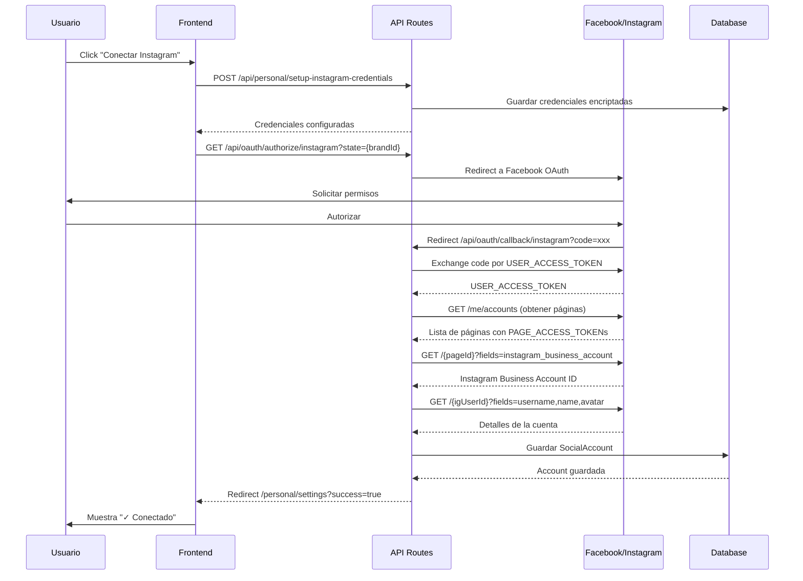

# 📱 Conexión de Instagram en Modo Personal

## ✅ Implementación Completada

Hemos integrado completamente el flujo de conexión de Instagram que ya existía en el modo agencia, adaptándolo para el modo personal.

---

## 🎯 ¿Cómo Funciona?

### **Paso 1: Accede a Configuración** ⚙️

1. Ve al Dashboard Personal: `/personal/dashboard`
2. Haz clic en **"Configuración"** en la barra lateral (o en el menú inferior en móvil)
3. Llegarás a: `/personal/settings`

### **Paso 2: Conecta Instagram** 📸

En la página de configuración verás una lista de plataformas:

```
┌─────────────────────────────────────────────────┐
│ Instagram                                       │
│ Conecta tu cuenta de Instagram Business        │
│                                  [Conectar →]   │
└─────────────────────────────────────────────────┘
```

**Al hacer clic en "Conectar":**

1. **Se configuran automáticamente las credenciales** de Instagram
   - Usa las credenciales globales de `.env.local`
   - `INSTAGRAM_APP_ID` y `INSTAGRAM_APP_SECRET`
   - Se guardan encriptadas en la base de datos

2. **Eres redirigido al flujo de OAuth de Facebook/Instagram**
   ```
   /api/oauth/authorize/instagram
   ↓
   Facebook OAuth Dialog
   ↓
   /api/oauth/callback/instagram
   ```

3. **Proceso de autorización completo:**
   - ✅ Autorizas la app con tu cuenta de Facebook
   - ✅ El sistema busca páginas de Facebook vinculadas
   - ✅ Detecta qué página tiene Instagram Business conectado
   - ✅ Obtiene el PAGE_ACCESS_TOKEN (necesario para Instagram API)
   - ✅ Guarda la cuenta en la base de datos

4. **Conexión exitosa:**
   ```
   ┌─────────────────────────────────────────────────┐
   │ Instagram                        ✓ Conectado    │
   │ @tu_usuario                                     │
   │                           [Desconectar]         │
   └─────────────────────────────────────────────────┘
   ```

---

## 🗂️ Archivos Creados/Modificados

### **Nuevos Archivos:**

1. **`/app/personal/settings/page.tsx`**
   - Página de configuración de redes sociales
   - Muestra plataformas disponibles (Instagram, Facebook, LinkedIn, X)
   - Botones para conectar/desconectar
   - Muestra estado de conexión y username

2. **`/app/api/brands/[brandId]/social-accounts/route.ts`**
   - GET: Obtiene todas las cuentas sociales de una marca
   - Verifica permisos de acceso
   - Devuelve cuentas activas

3. **`/app/api/social-accounts/[accountId]/route.ts`**
   - DELETE: Desconecta una cuenta social
   - Soft delete (marca como `isActive: false`)

4. **`/app/api/personal/setup-instagram-credentials/route.ts`**
   - POST: Configura automáticamente las credenciales de Instagram
   - Usa las credenciales globales del `.env.local`
   - Encripta y guarda en `oauth_credentials`

### **Archivos Modificados:**

5. **`/app/personal/layout.tsx`**
   - Actualizado enlace de configuración: `/settings` → `/personal/settings`

---

## 🔐 Requisitos Previos

### **1. Credenciales de Instagram en `.env.local`**

Ya las tienes configuradas:
```env
INSTAGRAM_APP_ID="1527682271593707"
INSTAGRAM_APP_SECRET="c618c83057cbdf9cb3c4f6a2ffd407fb"
```

### **2. Configuración de Facebook App**

En [Facebook Developers](https://developers.facebook.com/):

1. **OAuth Redirect URIs** configurados:
   ```
   https://haydee-sonantal-anthropophagously.ngrok-free.dev/api/oauth/callback/instagram
   http://localhost:3000/api/oauth/callback/instagram
   ```

2. **Permisos habilitados:**
   - ✅ `pages_show_list` - Listar páginas
   - ✅ `pages_read_engagement` - Leer engagement
   - ✅ `instagram_basic` - Acceso básico
   - ✅ `instagram_manage_comments` - Gestionar comentarios
   - ✅ `instagram_manage_messages` - Gestionar DMs
   - ✅ `instagram_manage_insights` - Analytics
   - ✅ `instagram_content_publish` - Publicar contenido

### **3. Cuenta de Instagram Business**

Para conectar Instagram necesitas:
- ✅ Una cuenta de Instagram convertida a **Instagram Business**
- ✅ Vinculada a una **página de Facebook**
- ✅ Ser administrador de la página de Facebook

---

## 📊 Flujo Técnico Detallado



---

## 🎨 Experiencia de Usuario

### **Vista Inicial (Sin Conectar)**

```
┌────────────────────────────────────────────────────┐
│  Configuración                                     │
│  Conecta tus redes sociales para empezar          │
├────────────────────────────────────────────────────┤
│                                                    │
│  Cuentas de Redes Sociales                        │
│  ─────────────────────────────────────────────     │
│                                                    │
│  📸 Instagram                                      │
│     Conecta tu cuenta de Instagram Business       │
│                                    [Conectar →]    │
│                                                    │
│  👍 Facebook                                       │
│     Conecta tu página de Facebook                 │
│                                    [Conectar →]    │
│                                                    │
│  💼 LinkedIn                                       │
│     Conecta tu perfil de LinkedIn                 │
│                                    [Conectar →]    │
│                                                    │
│  🐦 X (Twitter)                                    │
│     Conecta tu cuenta de X                        │
│                                    [Conectar →]    │
│                                                    │
└────────────────────────────────────────────────────┘
```

### **Vista Conectada**

```
┌────────────────────────────────────────────────────┐
│  📸 Instagram                     ✓ Conectado      │
│     👤 @tu_usuario_instagram                       │
│                         [Desconectar]              │
└────────────────────────────────────────────────────┘
```

---

## 🔗 Integración con el Dashboard

Una vez conectada tu cuenta de Instagram, podrás:

### **1. Publicar desde `/personal/create`**
```javascript
// Selecciona Instagram como plataforma
// La IA genera contenido optimizado
// Publicas directamente o programas
```

### **2. Ver mensajes en `/personal/inbox`**
```javascript
// DMs de Instagram aparecen aquí
// Responder con IA
// Todo unificado
```

### **3. Ver analytics en `/personal/analytics`**
```javascript
// Alcance, engagement, seguidores
// Gráficos de rendimiento
// Top posts
```

### **4. Programar en `/personal/calendar`**
```javascript
// Ver publicaciones programadas
// Editar horarios
// Ver estados (publicado/programado/fallido)
```

---

## 🧪 Cómo Probar

### **Paso 1: Ve a Configuración**
```
https://haydee-sonantal-anthropophagously.ngrok-free.dev/personal/settings
```

### **Paso 2: Haz clic en "Conectar" en Instagram**

### **Paso 3: Autoriza con Facebook**
- Selecciona la página de Facebook que tiene Instagram conectado
- Otorga todos los permisos solicitados

### **Paso 4: Verifica la Conexión**
- Deberías ver tu username de Instagram
- Badge "✓ Conectado"
- Botón "Desconectar"

### **Paso 5: Crea tu Primera Publicación**
```
/personal/create → Selecciona Instagram → Publica
```

---

## 🐛 Resolución de Problemas

### **Error: "No Instagram credentials found"**
**Solución:** Las credenciales se configuran automáticamente al cargar `/personal/settings`

### **Error: "No pages found"**
**Causa:** Tu cuenta de Facebook no tiene páginas
**Solución:** Crea una página de Facebook primero

### **Error: "No Instagram account found"**
**Causa:** Ninguna de tus páginas tiene Instagram Business conectado
**Solución:**
1. Ve a tu página de Facebook
2. Configuración → Instagram
3. Conecta tu cuenta de Instagram Business

### **Error: "OAuth cancelled"**
**Causa:** Cancelaste el proceso de autorización
**Solución:** Vuelve a intentar y completa el proceso

---

## 📝 Notas Técnicas

### **Tokens de Acceso**
- Se guarda el **PAGE_ACCESS_TOKEN** (no el USER_ACCESS_TOKEN)
- Razón: Instagram DMs requieren PAGE token
- Los tokens están encriptados en la base de datos

### **Seguridad**
```typescript
// Credenciales encriptadas con AES-256-GCM
const encrypted = encrypt(pageAccessToken)

// Guardado seguro
await prisma.socialAccount.create({
  accessToken: encrypted, // Encriptado
  ...
})
```

### **Permisos Granulares**
Cada permiso de Instagram sirve para:
- `instagram_basic`: Leer perfil y posts
- `instagram_manage_comments`: Responder comentarios
- `instagram_manage_messages`: DMs (inbox)
- `instagram_manage_insights`: Analytics
- `instagram_content_publish`: Publicar posts/stories/reels

---

## 🚀 Próximos Pasos

Ahora que tienes Instagram conectado, puedes:

1. **Crear contenido** con el generador de IA
2. **Programar publicaciones** en el calendario
3. **Gestionar mensajes** en el inbox
4. **Ver estadísticas** en analytics

¡Tu modo personal está completamente funcional con Instagram! 🎉

---

**Creado**: 2025-11-22
**Versión**: 1.0.0
